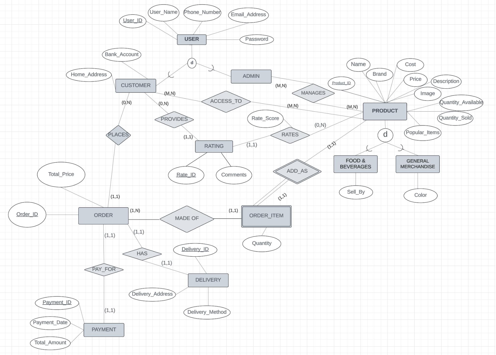
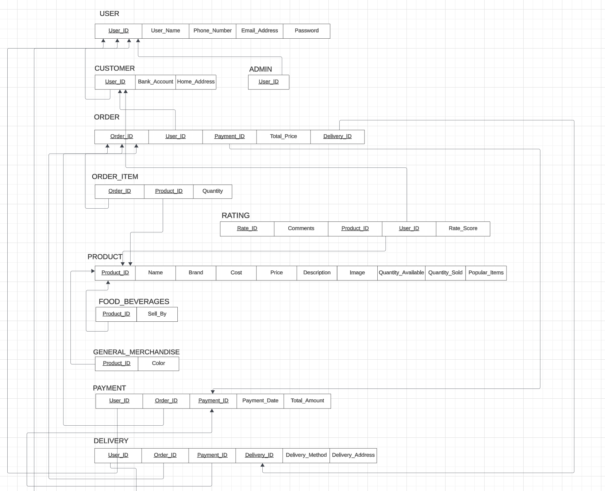

# SV Eshop Registration System Using ChatGPT

## Description

SV E-Shop Registration System Using LLM is an online shopping web application, operated by admin to enhance the shopping experience for students and faculties in Silicon Valley (SV) campus community. This system enables students to browse a wide variety of products, manage their orders, track delivery and complete secure payments. Administrators are provided with tools to efficiently manage the product catalog, track transactions, communicate with students, and oversee overall system operations.

## Features

1. Product Management:

- Product Listing & Filtering: Displays all products with filters for category, brand, rating, price, and popularity. Supports dynamic AJAX filtering.
- Product Details: Shows detailed information, including dynamic quantity range based on stock.
- Admin Tools: Allows product creation, editing, and deletion, with category-specific fields like sell_by (Food & Beverage) or color (General Merchandise).

2. User Management:

- Sign-Up & Sign-In: Supports role-based user creation (customer or admin) with additional details for customers (e.g., bank account).
- Session Management: Authenticates users, assigns roles, and supports sign-out.

3. Order Management:

- Add to Order & In-Progress Orders: Enables adding products to orders and viewing in-progress orders with item details and total cost.
- Submit & Complete Orders: Processes orders, updates stock, and creates Payment and Delivery records.
- Order Summary: Displays payment, delivery, and order details.

4. Chat-Based Assistance
- Provides a natural language interface for both customers and admins using OpenAI's GPT API with queries tailored to user roles for personalized assistance.

5. Database Integration
- Uses MySQL with entities like Products, Orders, OrderItem, Payment, Delivery, User, Admin, and Customer, ensuring secure and efficient data handling.

## Enhanced Entity-Relationship

https://storage.googleapis.com/eshop_product_images/EER_Diagram.png

## Relation Model

https://storage.googleapis.com/eshop_product_images/Relation_Model.png

## Relational Algebra

Refer to Database Design folder for 20 relational algebra for this project.

## Installation and Setup

1. Cline the repository from Github.

2. Navigate to project directory and install virtual environment using `pip install virtualenv`.

3. Install and initialize the Cloud SDK using link: https://cloud.google.com/sdk/docs/install . Reconfigure environment using `gcloud init`. Login into gcloud by using `gcloud auth application-default login`.

4. Navigate to project directory and install all the required dependencies using `pip install -r requirements.txt` for Python.

5. Source sample data into Google Cloud SQL Instance by using `source all_ddl.sql;` and `source all_dml.sql;`. 

6. Set up database connection to Google Cloud SQL and configure the database settings in `settings.py`. 

7. Run the commands for migration using `python manage.py makemigrations` and `python manage.py migrate`.

8. Run the project on the development server using `python manage.py runserver`.